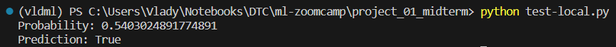
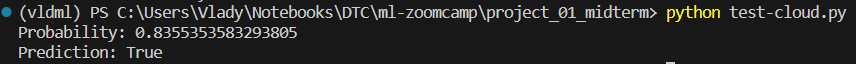
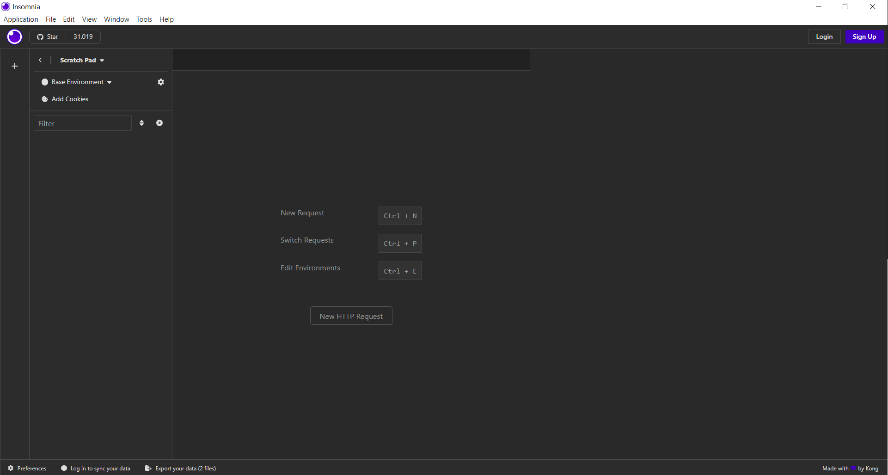
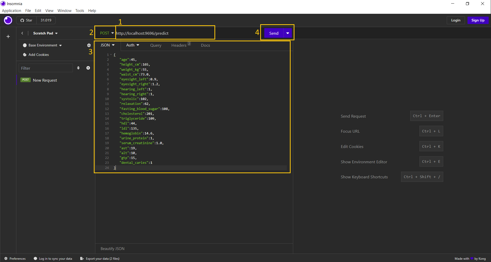
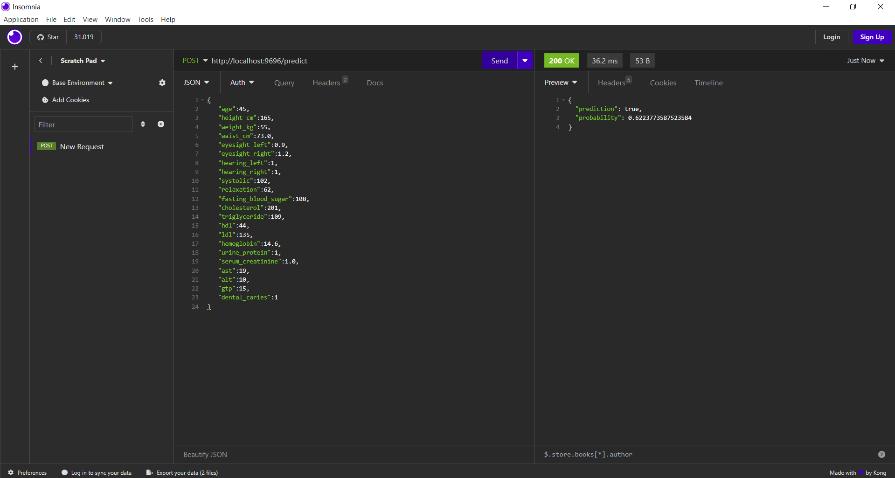
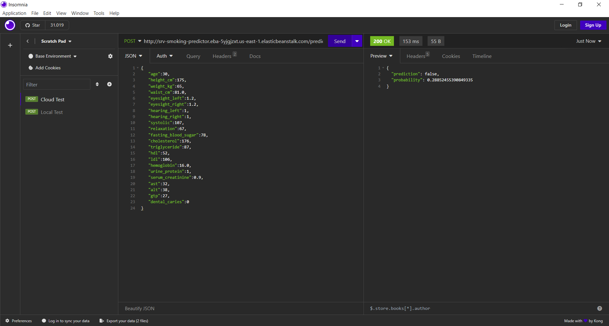

# Smoker Status Prediction using Bio-Signals

## Table of Contents
1. [Introduction](#introduction)
2. [Dataset](#dataset)
3. [Prerequisites](#prerequisites)
4. [Installation Steps](#installation-steps)
5. [Deployment](#deployment)
6. [Usage](#usage)

## Introduction
Smoking has been proven to negatively affect health in a multitude of ways. It harms nearly every organ of the body, causes many diseases, and reduces the life expectancy of smokers. As of 2018, smoking is the leading cause of preventable morbidity and mortality worldwide.

A report by the World Health Organization predicts that the number of deaths caused by smoking will reach 10 million by 2030.

Despite the promotion of evidence-based treatments for smoking cessation, less than one-third of participants achieve the goal of abstinence. Counseling for smoking cessation is often seen as ineffective and time-consuming by many physicians, who do not routinely practice it. To address this, various factors have been proposed to identify smokers with a better chance of quitting. However, the individual use of these factors for prediction can lead to conflicting and non-straightforward results for both physicians and patients. Predictive models using machine learning have emerged as a favorable solution to understand the chance of quitting smoking for each individual smoker.

A group of scientists are working on predictive models with smoking status as the prediction target. The task is to assist in creating a machine learning model to identify an individual's smoking status using bio-signals.

The goal is to use the provided bio-signal data to predict the smoking status of individuals, aiding in the broader effort to support smoking cessation initiatives and improve global health.

## Dataset
This project is based on a dataset found on Kaggle:

https://www.kaggle.com/datasets/gauravduttakiit/smoker-status-prediction-using-biosignals/data

TThe dataset contains the following columns:

- `age`: Age categorized in 5-year gaps.
- `height(cm)`: Height of the individual in centimeters.
- `weight(kg)`: Weight of the individual in kilograms.
- `waist(cm)`: Waist circumference length in centimeters.
- `eyesight(left)`: Left eye vision measurement.
- `eyesight(right)`: Right eye vision measurement.
- `hearing(left)`: Left ear hearing measurement.
- `hearing(right)`: Right ear hearing measurement.
- `systolic`: Systolic blood pressure measurement.
- `relaxation`: Blood pressure measurement during relaxation.
- `fasting blood sugar`: Measurement of blood sugar levels after fasting.
- `Cholesterol`: Total cholesterol measurement.
- `triglyceride`: Triglyceride level measurement.
- `HDL`: High-Density Lipoprotein (cholesterol type) level measurement.
- `LDL`: Low-Density Lipoprotein (cholesterol type) level measurement.
- `hemoglobin`: Hemoglobin level measurement.
- `Urine protein`: Measurement of protein in urine.
- `serum creatinine`: Serum creatinine level measurement.
- `AST`: Measurement of glutamic oxaloacetic transaminase type.
- `ALT`: Measurement of glutamic oxaloacetic transaminase type.
- `Gtp`: γ-GTP measurement.
- `dental caries`: Dental caries status.
- `smoking`: Smoking status of the individual.

## Prerequisites:

- `git`: For cloning the repository.
- `anaconda` or `conda`: For creating and managing the virtual environment.
- `docker`: For local deployment and testing.
- `AWS CLI`: To work with AWS.
- `Insomnia`: For API testing.

## Installation Steps:

### Conda Environment

1. **Clone the Repository**:
   
   Start by cloning the `ml-zoomcamp` repository from GitHub into a directory of your choice (`<folder_name>`). Replace `<folder_name>` with the desired directory name:

   ```bash
   $ git clone https://github.com/JorgeAbrego/ml-zoomcamp.git <folder_name>
   ```

2. **Navigate to the Project Directory**:

    Once the repository is cloned, navigate to the `project_01_midterm` directory inside it:

   ```bash
   $ cd <folder_name>/project_01_midterm
   ```

3. **Create a Conda Virtual Environment**:

    Next, set up a new conda virtual environment named `ml-midterm` using Python 3.10:

   ```bash
   $ conda create -n ml-midterm python=3.10
   ```

4. **Activate the Virtual Environment**:

    With the environment created, activate it using:

   ```bash
   $ conda activate ml-midterm
   ```

5. **Install Required Dependencies**:

    The project has a list of required libraries and packages specified in the `requirements.txt` file. Install these using:

   ```bash
   $ pip install -r requirements.txt
   ```

### Pipenv Environment

1. **Install pipenv**:

   Install Pipenv by running the following command:

   ```bash
   $ pip install pipenv
   ```
2. **Create a Virtual Environment**:

   Create a virtual environment using Pipenv.

   ```bash
   $ pipenv --python 3.10
   ```

3. **Install Dependencies from Pipfile.lock**:

   Install all the dependencies specified in the Pipfile.lock by running the following command:

   ```bash
   $ pipenv sync
   ```

4. **Activate the Virtual Environment**:
   
   Activate the Virtual Environment

   ```bash
   $ pipenv shell
   ```

To exit the virtual environment and return to your global Python environment, simply type `exit` and press `Enter`.

## Deployment

### Local Run

**Running the Service on Linux Using Gunicorn**

To run the service locally on a Linux system utilizing the Gunicorn WSGI HTTP Server, follow these steps:

```bash
$ pipenv run gunicorn --bind 0.0.0.0:9696 predict:app
```

This command starts Gunicorn and binds it to all network interfaces on port `9696`, allowing the `predict:app` to be accessible. To stop the service, press `Ctrl+C` in the terminal.

**Running the Service on Windows Using Waitress**

For running the service on a Windows platform, the Waitress server is employed. Execute the following command:

```bash
$ pipenv run waitress-serve --listen=0.0.0.0:9696 predict:app
```

This instruction initiates the Waitress server, listening on all network interfaces at port `9696`, serving the `predict:app`. To stop the service, press `Ctrl+C`in the command prompt.

**Note**: Ensure that the environment and dependencies are correctly set up and the required libraries are installed for a seamless execution of the service.

### Docker Container

Execute the following command to build the Docker image. This will create an image with the tag `smoking-predictor:v1` (you can pick another name if you want).

```bash
$ docker build -t smoking-predictor:v1 .
```

This process might take several minutes as Docker needs to download the base images and build the necessary layers for your application.

Run the following command to start a container based on the image you just created. This command also maps port `9696` of the container to port `9696` on your local machine.

```bash
$ docker run -it --name SmokingPredictor -p 9696:9696 smoking-predictor:v1
```

Upon executing this command, the container will start, and you should be able to interact with the prediction model through the specified port.

To stop the service, press `Ctrl+C` in the command prompt.

### AWS Elastic Beanstalk

Before start, make sure your credentials are set, more information [here](https://docs.aws.amazon.com/cli/latest/userguide/cli-chap-configure.html). Also, check if you have set IAM roles for Elastic Beanstalk, more information [here](https://docs.aws.amazon.com/IAM/latest/UserGuide/id_roles.html)

Install AWS Elastic Beanstalk client on pipenv environmet:

```bash
$ pipenv install awsebcli --dev
```

The `--dev` flag indicates that you want to install it as a development dependency, which means it will be listed in the `[dev-packages]` section of your Pipenv Pipfile. Development dependencies are typically used for tools, libraries, or packages that are only needed during the development and testing phase of a project.

To use and test `eb client`, just enter to pipenv environment:

```bash
$ pipenv shell
```

Test if eb client installation was successful

```bash
$ eb --version
```

This should show something like this:

> EB CLI 3.20.10 (Python 3.10.13 | packaged by Anaconda, Inc. | (main, Sep 11 2023, 13:24:38) [MSC v.1916 64 bit (AMD64)])

Now init the project

```bash
$ eb init -p docker -r us-east-1 smoking-predictor
```

If you have set multiple profiles, you can use:

```bash
eb init -p docker -r us-east-1 --profile <PROFILE> smoking-predictor
```

If everything is OK, it should shows:

> Application smoking-predictor has been created.

To test locally, just run:

```bash
$ eb local run  --port 9696
```

In order to launch service to cloud, just run:

```bash
$ eb create srv-smoking-predictor
```

After all test were made, don't forget to terminate EB service, just run:

```bash
$ eb terminate srv-smoking-predictor
```

## Usage

### Using Test Python Files

For testing this API using the provided Python scripts: test-cloud.py for cloud-based tests and test-local.py for local tests.

*Local Test*

To test the API locally, follow these steps:

1. Open your terminal or command prompt.
2. Navigate to the directory containing the test-local.py script.
3. Execute the script by running:

   ```bash
   python test-local.py
   ```

Example:



*Cloud Test*

For testing the cloud-based API, the steps are similar:

1. Open your terminal or command prompt.
2. Navigate to the directory containing the test-cloud.py script.
3. Execute the script by running:

   ```bash
   python test-cloud.py
   ```

Example:



### Using API Client

There are several clients available for testing API applications, and one of the notable ones is `Insomnia`. It's a powerful and flexible tool designed for interacting with APIs. It enables developers to set up, send, and analyze HTTP requests and responses with ease. If you don't have Insomnia on your machine, it's easy to get started by downloading it from [here](https://insomnia.rest/download).

**Step 1: Navigating the Initial Menu of Insomnia**

Upon opening Insomnia for the first time, you'll be presented with the initial menu where you can either create a new request or open an existing workspace. To get started, click on `New HTTP Request`



**Step 2: Configuring the Request**

1. **URL**: Enter the address of the API endpoint you wish to communicate with in the URL bar

2. **Method**: Choose the appropriate method for your request (for example, POST) from the dropdown menu next to the URL bar.

3. **JSON Data**: If you are executing a method such as POST or PUT that requires a message body, select 'Body' beneath the URL bar. Then choose 'JSON' and enter or paste the JSON you wish to send in the request body.

4. **Send request**: Clic on `Send` button to make the request to server.



**Step 3: Example of Response**

After you have configured your request and sent it, Insomnia will display the response in the same window.

These are examples in local and cloud deployment:

*Local Test*

For local testing, just fill the local address in URL box



*Cloud/Remote Test*

For cloud/remote testing, just fill API remote address in URL box



If you want to try using API client, here are five JSON examples:

Example 1:
```json
{
   "age":45,
   "height_cm":165,
   "weight_kg":55,
   "waist_cm":73.0,
   "eyesight_left":0.9,
   "eyesight_right":1.2,
   "hearing_left":1,
   "hearing_right":1,
   "systolic":102,
   "relaxation":62,
   "fasting_blood_sugar":108,
   "cholesterol":201,
   "triglyceride":109,
   "hdl":44,
   "ldl":135,
   "hemoglobin":14.6,
   "urine_protein":1,
   "serum_creatinine":1.0,
   "ast":19,
   "alt":10,
   "gtp":15,
   "dental_caries":1
}
```
smoking = 1

Example 2:
```json
{
   "age":45,
   "height_cm":170,
   "weight_kg":80,
   "waist_cm":93.0,
   "eyesight_left":1.2,
   "eyesight_right":1.5,
   "hearing_left":1,
   "hearing_right":1,
   "systolic":130,
   "relaxation":80,
   "fasting_blood_sugar":87,
   "cholesterol":215,
   "triglyceride":246,
   "hdl":52,
   "ldl":114,
   "hemoglobin":15.3,
   "urine_protein":1,
   "serum_creatinine":1.0,
   "ast":26,
   "alt":15,
   "gtp":78,
   "dental_caries":0
}
```
smoking = 1

Example 3:
```json
{
   "age":30,
   "height_cm":175,
   "weight_kg":65,
   "waist_cm":81.0,
   "eyesight_left":1.2,
   "eyesight_right":1.2,
   "hearing_left":1,
   "hearing_right":1,
   "systolic":107,
   "relaxation":67,
   "fasting_blood_sugar":78,
   "cholesterol":176,
   "triglyceride":87,
   "hdl":52,
   "ldl":106,
   "hemoglobin":16.0,
   "urine_protein":1,
   "serum_creatinine":0.9,
   "ast":32,
   "alt":38,
   "gtp":27,
   "dental_caries":0
}
```
smoking = 0

Example 4:
```json
{
   "age":35,
   "height_cm":165,
   "weight_kg":65,
   "waist_cm":80.0,
   "eyesight_left":1.5,
   "eyesight_right":1.5,
   "hearing_left":1,
   "hearing_right":1,
   "systolic":127,
   "relaxation":81,
   "fasting_blood_sugar":106,
   "cholesterol":218,
   "triglyceride":138,
   "hdl":61,
   "ldl":129,
   "hemoglobin":17.9,
   "urine_protein":1,
   "serum_creatinine":0.9,
   "ast":26,
   "alt":17,
   "gtp":97,
   "dental_caries":0
}
```
smoking = 1

Example 5:
```json
{
   "age":60,
   "height_cm":160,
   "weight_kg":65,
   "waist_cm":83.0,
   "eyesight_left":0.7,
   "eyesight_right":0.8,
   "hearing_left":1,
   "hearing_right":1,
   "systolic":122,
   "relaxation":89,
   "fasting_blood_sugar":98,
   "cholesterol":237,
   "triglyceride":172,
   "hdl":55,
   "ldl":148,
   "hemoglobin":16.1,
   "urine_protein":1,
   "serum_creatinine":1.0,
   "ast":35,
   "alt":25,
   "gtp":54,
   "dental_caries":0
}
```
smoking = 0

**Note**: If you want to try this API, it will be able until november 18, 2023. URL is: `http://srv-smoking-predictor.eba-5yjgjzxt.us-east-1.elasticbeanstalk.com/predict`. After that date, EB service will be terminated.