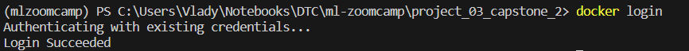
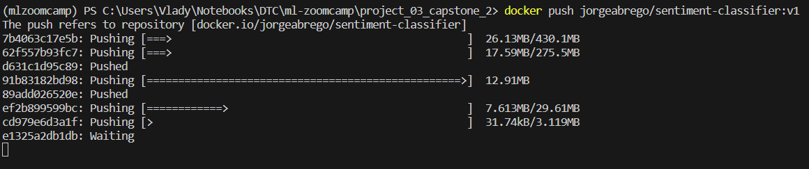
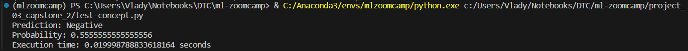

# X (Twitter) Sentiment Classification


## Table of Contents
1. [Introduction](#introduction)
2. [Dataset](#dataset)
3. [Prerequisites](#prerequisites)
4. [Installation Steps](#installation-steps)
5. [Deployment](#deployment)
6. [Usage](#usage)

## Introduction

Sentiment analysis, or opinion mining, is a powerful technique used in Natural Language Processing (NLP) to identify, extract, and quantify subjective information from text data. It involves determining whether a piece of writing expresses positive, negative, or neutral sentiments. This analysis is crucial for understanding human emotions expressed in digital content, offering insights into consumer opinions, social trends, and broader public sentiment towards topics, products, or events. By analyzing sentiments, organizations and individuals can make informed decisions based on the emotional tone conveyed in textual data.

In this project, I employ machine learning to automate the process of sentiment analysis. Machine learning provides the tools to analyze large volumes of textual data efficiently, recognizing complex patterns that indicate sentiment. Using a dataset composed of tweets, this project aims to classify each tweet into positive, negative, or neutral categories, demonstrating the capabilities of machine learning in deciphering the nuances and intricacies of human language and emotion.

### Background

Sentiment analysis on social media platforms like Twitter has become increasingly significant for businesses, governments, and individuals to gauge public opinion and reactions towards products, services, policies, and events. Traditional sentiment analysis techniques involved manual tagging and categorization of sentiments, which was time-consuming and prone to errors. The advent of machine learning and, more specifically, neural networks, has revolutionized this process, offering automated and more accurate analysis of textual data at scale.

### Project Objective

The primary goal of this project is to delve into various machine learning models to conduct sentiment analysis on a collection of tweets. Our approach involves a systematic exploration of different machine learning techniques to identify which model or method best suits the intricate task of accurately classifying tweets into positive, negative, or neutral sentiments. This selection process is critical in determining the most effective algorithm that balances accuracy, efficiency, and scalability for our sentiment analysis project.

The selected model will be deployed locally for initial testing, then scaled to a cloud environment using AWS Lambda and AWS API Gateway. This dual-phase deployment strategy ensures model accuracy and functionality before offering scalable, real-time analysis services. It exemplifies the model's adaptability for both development testing and widespread application access.

### Potential Applications

The sentiment analysis model developed in this project can be applied in a wide range of scenarios, including but not limited to:

* **Marketing and Brand Management:** Companies can use sentiment analysis to monitor brand reputation and customer feedback on social media platforms, allowing for real-time responses and strategic planning.
* **Market Research:** By analyzing sentiments towards products or services, businesses can gain insights into consumer preferences and emerging trends, guiding product development and innovation.
* **Public Relations:** Sentiment analysis can help identify potential PR crises before they escalate, allowing organizations to take proactive measures.

## Dataset

This project utilizes the "Twitter Sentiment Analysis" dataset available on Kaggle. It consists of two separate sets: one for training and another for validation. The training dataset contains a large number of tweets, each associated with a sentiment classification (positive, negative, or neutral) towards specific entities or topics. The validation dataset, designed to test the accuracy and performance of the trained model, follows a similar structure but is used exclusively for evaluating the model's predictive capabilities. This separation ensures a robust methodology for training and fine-tuning the sentiment analysis model, allowing it to learn from a comprehensive collection of examples before being tested on unseen data.

The full dataset is available at [Kaggle](https://www.kaggle.com/datasets/jp797498e/twitter-entity-sentiment-analysis). For convenience, I have also provided both datasets in data folder.

## Prerequisites:

- `git`: For cloning the repository.
- `anaconda` or `conda`: For creating and managing the virtual environment.
- `docker`: For local deployment and testing.
- `AWS CLI`: To work with AWS.
- `Insomnia`: For API testing.

## Installation Steps:

### Conda Environment for Experimentation

1. **Clone the Repository**:
   
   Start by cloning the `ml-zoomcamp` repository from GitHub into a directory of your choice (`<folder_name>`). Replace `<folder_name>` with the desired directory name:

   ```bash
   $ git clone https://github.com/JorgeAbrego/ml-zoomcamp.git <folder_name>
   ```

2. **Navigate to the Project Directory**:

    Once the repository is cloned, navigate to the `project_02_capstone_1` directory inside it:

   ```bash
   $ cd <folder_name>/project_03_capstone_2
   ```

3. **Create a Conda Virtual Environment**:

    Next, set up a new conda virtual environment named `ml-project-3` using Python 3.10:

   ```bash
   $ conda create -n ml-project-1 python=3.10
   ```

4. **Activate the Virtual Environment**:

    With the environment created, activate it using:

   ```bash
   $ conda activate ml-project-2
   ```

5. **Install Required Dependencies**:

    The project has a list of required libraries and packages specified in the `requirements.txt` file. Install these using:

   ```bash
   $ pip install -r requirements.txt
   ```

## Deployment

### Local Test (Docker Container)

Execute the following command to build the Docker image. This will create an image with the tag `vegetables-classifier:v1` (you can pick another name if you want).

```bash
$ docker build -t sentiment-classifier:v1 .
```

This process might take several minutes as Docker needs to download the base images and build the necessary layers for your application.

Run the following command to start a container based on the image you just created. This command also maps port `9696` of the container to port `9696` on your local machine.

```bash
$ docker run -it --name Sentiment-Classifer -p 9696:9696 sentiment-classifier:v1
```

### Pushing image to Docker Hub

First, you should access to Docker Hub, and look for `Create repository`:


Set a repository name and check it as `Public`, if you want, write a short description of your image:


Once repository is created, you will see its info:


Now, it's time to push image; let's back to console an login to Docker Hub:

```bash
$ docker login
```



Once logged in, you should tag your image to new repository name:

```bash
$ docker tag sentiment-classifier:<tag> <account-name>/sentiment-classifier:<tag>
```


Then , let's push it to Docker Hub:

```bash
$ docker push <account-name>/sentiment-classifier:<tag>
```



If everything is ok, you should see the image in Docker Hub repository, for example:


And, in Docker Hub you will see the new tag, you can create more tags, for example, if you use a create an image with a different version of python.


Now, image is ready to be deployed in any kind of service.

## Usage

### Using Test Python Files

For testing this API using the provided Python scripts: test-cloud.py for cloud-based tests and test-local.py for local tests.

To test the API locally, follow these steps:

1. Open your terminal or command prompt.
2. Navigate to the directory containing the test-local.py script.
3. Execute the script by running:

   ```bash
   python test-concept.py
   ```

Example:



### Using API Client

There are several clients available for testing API applications, and one of the notable ones is `Insomnia`. It's a powerful and flexible tool designed for interacting with APIs. It enables developers to set up, send, and analyze HTTP requests and responses with ease. If you don't have Insomnia on your machine, it's easy to get started by downloading it from [here](https://insomnia.rest/download).

**Step 1: Navigating the Initial Menu of Insomnia**

Upon opening Insomnia for the first time, you'll be presented with the initial menu where you can either create a new request or open an existing workspace. To get started, click on `New HTTP Request`


**Step 2: Configuring the Request**

1. **URL**: Enter the address of the API endpoint you wish to communicate with in the URL bar

2. **Method**: Choose the appropriate method for your request (for example, POST) from the dropdown menu next to the URL bar.

3. **JSON Data**: If you are executing a method such as POST or PUT that requires a message body, select 'Body' beneath the URL bar. Then choose 'JSON' and enter or paste the JSON you wish to send in the request body.

4. **Send request**: Clic on `Send` button to make the request to server.


**Step 3: Example of Response**

After you have configured your request and sent it, Insomnia will display the response in the same window.

This is an example in local deployment:

For local testing, just fill the local address in URL box


